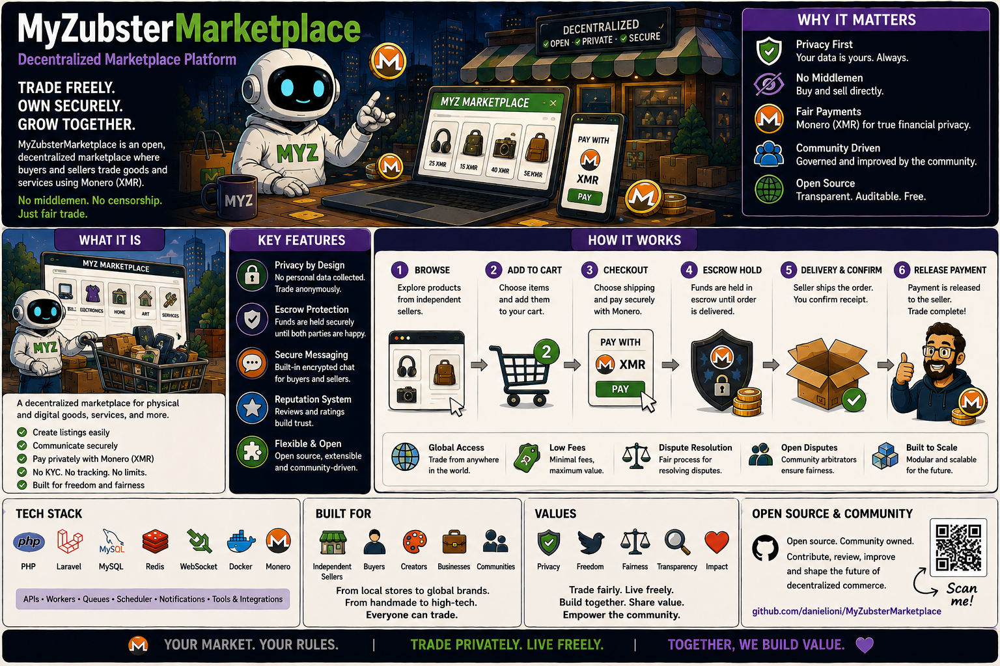

# MyZubster Marketplace

<p align="center">
  
</p>

> 🌍 **Understand MyZubster in your language:** [Global multilingual guide](https://github.com/MyZubster-Ecosystem/myzubster/blob/main/docs/i18n/README.md) — English, Italiano, Español, Français, Deutsch, Português, 中文, 日本語, 한국어, العربية, हिन्दी, Русский, Türkçe, Bahasa Indonesia, Polski, Українська, বাংলা, اردو, فارسی, Kiswahili.
>
> MyZubster connects real-world observations, verifiable evidence, collaborative bounties and platform rewards. **MYZ is currently an internal reward/accounting ledger; external XMR/token/blockchain settlement is separate and independently verified.**

Marketplace/service repository in the MyZubster ecosystem, currently containing garden and sensor-oriented API work plus historical bounty-linked development.

## Status

**Development / active validation.** Implemented endpoints and tests should be verified from the current source tree before production use.

Historical bounty labels or amounts in issues/commits are records of project intent/work tracking. They are **not proof that an external XMR/MYZ settlement occurred**.

## Current API areas

### Gardens

```text
GET    /api/gardens
GET    /api/gardens/:id
GET    /api/gardens/nearby
POST   /api/gardens
PUT    /api/gardens/:id
DELETE /api/gardens/:id
```

### Sensors

```text
POST /api/sensors/data
GET  /api/sensors/garden/:id
GET  /api/sensors/garden/:id/latest
GET  /api/sensors/garden/:id/stats
```

Treat this list as a repository overview; verify the actual router/controller implementation and tests when integrating.

## Bounty history

Some features originated from bounty-labelled work, including garden map and Arduino pH/EC tasks. A feature being implemented or merged does not establish that the associated reward was externally paid.

Current bounty rules are centralized here:

- [MyZubster Bounty System](https://github.com/MyZubster-Ecosystem/myzubster/blob/main/BOUNTIES.md)
- [Ecosystem Architecture](https://github.com/MyZubster-Ecosystem/myzubster/blob/main/docs/ECOSYSTEM.md)

MYZ in the current core platform is an internal reward/accounting ledger. Any external XMR/token settlement requires independently verifiable payment evidence before it can be represented as `PAID`.

See `BOUNTIES.md` in this repository for Marketplace-specific bounty scope.

## Development

Use the package scripts present in the repository. A normal Node.js workflow is:

```bash
npm ci
npm test
```

Check `.env.example` and the actual package scripts before starting services. Do not commit secrets or production credentials.

## Security

Sensor/garden APIs should validate authentication, authorization, input ranges and ownership boundaries where applicable. External payment/provider integrations must fail closed and must not self-declare settlement finality.

## Related repositories

- [myzubster](https://github.com/MyZubster-Ecosystem/myzubster) — core ecosystem
- [MyZubsterGateway](https://github.com/MyZubster-Ecosystem/MyZubsterGateway) — integration/settlement boundary
- [MyZubster-App](https://github.com/MyZubster-Ecosystem/MyZubster-App) — client application
- [myzubster-docs](https://github.com/MyZubster-Ecosystem/myzubster-docs) — documentation hub

---

## Official project identity

MyZubster is maintained within the [MyZubster-Ecosystem](https://github.com/MyZubster-Ecosystem) organization. Canonical public administrator/maintainer reference: **[Daniel Ioni (@DanielIoni-creator)](https://github.com/DanielIoni-creator)**.

This link is a stable public project-identity reference. By itself, it is not a cryptographic signature or legal identity certification.
